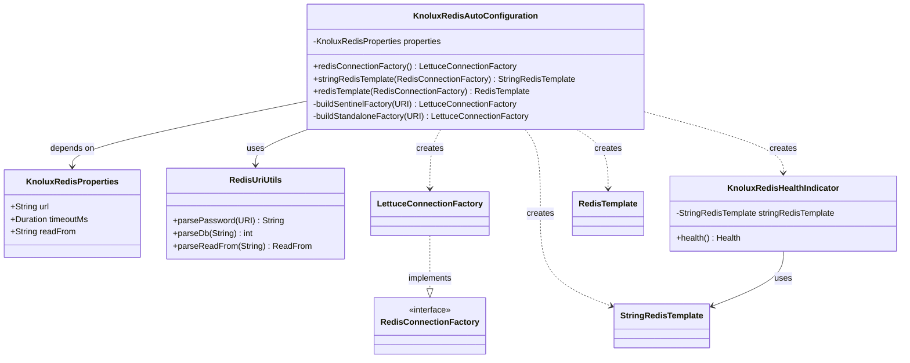
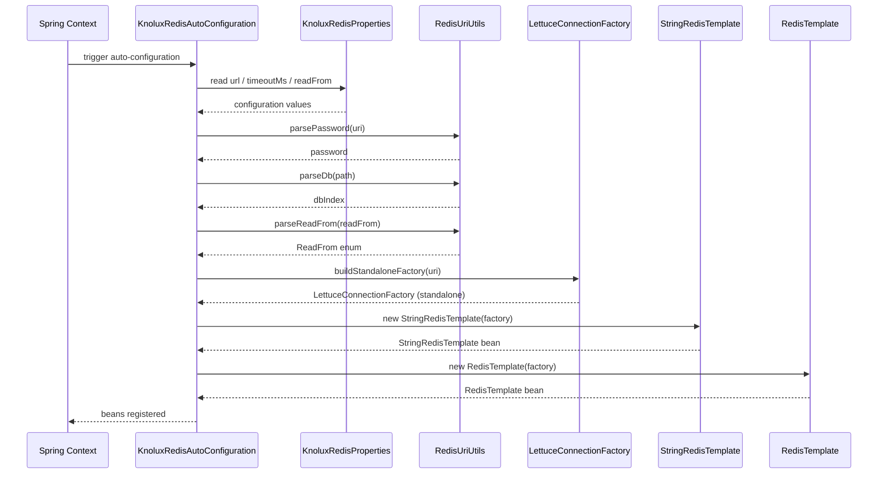
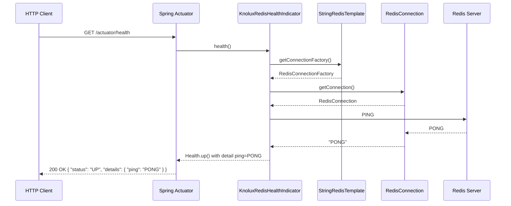

# Redis 模組架構圖

本文件包含 `knolux-redis-spring-boot-starter` 模組的 UML 類別圖與關鍵流程時序圖。

---

## 類別圖

---

## 時序圖 1 — 應用程式啟動（Standalone 模式）

---

## 時序圖 2 — 健康檢查（GET /actuator/health）

> **注意**：`KnoluxRedisHealthIndicator` 目前使用 `@Component` 註解，在 Spring Boot Starter 函式庫情境中，此元件可能因
> component scan 路徑未涵蓋函式庫套件而無法被自動偵測，導致上述健康檢查流程靜默失效。建議改由
`KnoluxRedisAutoConfiguration`
> 以條件式 `@Bean` 管理此元件。詳見代碼審查報告 R2。
