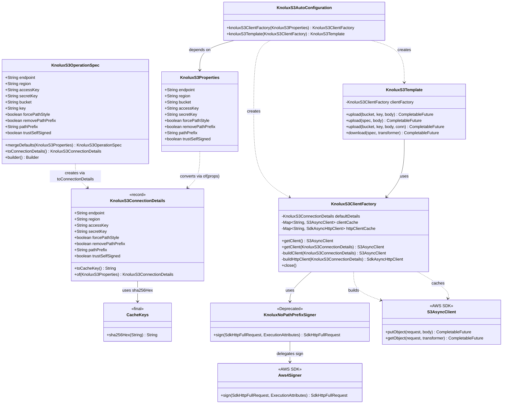
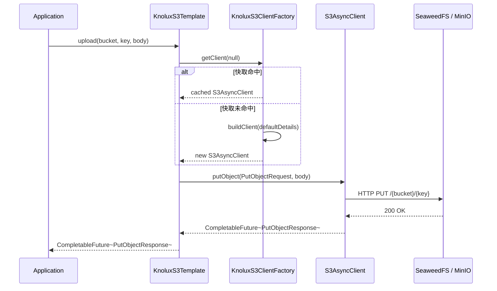
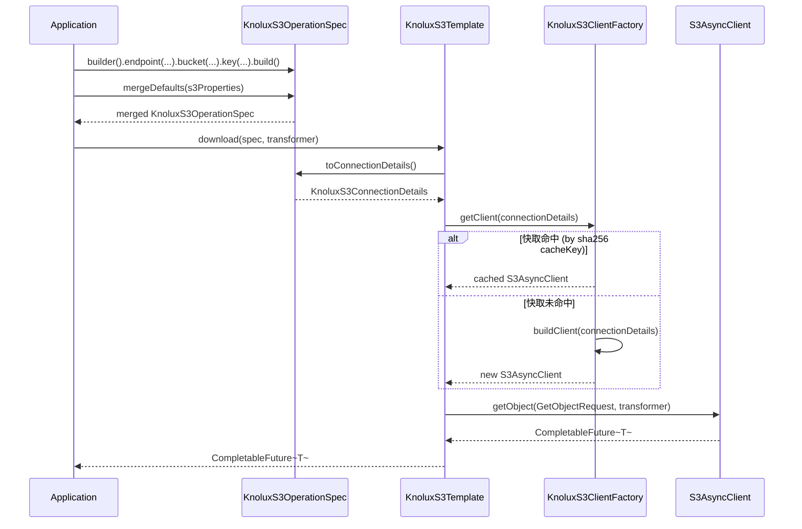
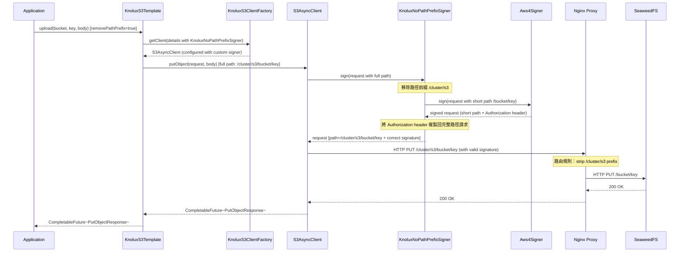

# S3 模組架構圖

本文件包含 `knolux-s3-spring-boot-starter` 模組的 UML 類別圖與關鍵流程時序圖。

---

## 類別圖

---

## 時序圖 1 — 靜態模式 Upload

---

## 時序圖 2 — 動態模式 Download

---

## 時序圖 3 — Nginx 代理場景（簽章流程）

> 適用於透過 Nginx 反向代理存取 SeaweedFS，且 Nginx 設定了路徑前綴路由（如 `/cluster/s3/` → SeaweedFS `/`）的部署場景。簽章必須以短路徑計算，但 HTTP 請求需帶完整長路徑。

> **設計說明**：`KnoluxNoPathPrefixSigner` 雖然使用了 AWS SDK v2 中已標記 `@Deprecated` 的 `Signer` SPI，但在此 Nginx 代理場景中，由於 `ExecutionInterceptor` 無法在簽章計算階段介入修改簽章路徑（簽章完成後修改 URL 會使簽章失效），此為目前唯一可行的技術方案。詳見代碼審查報告 S3。
